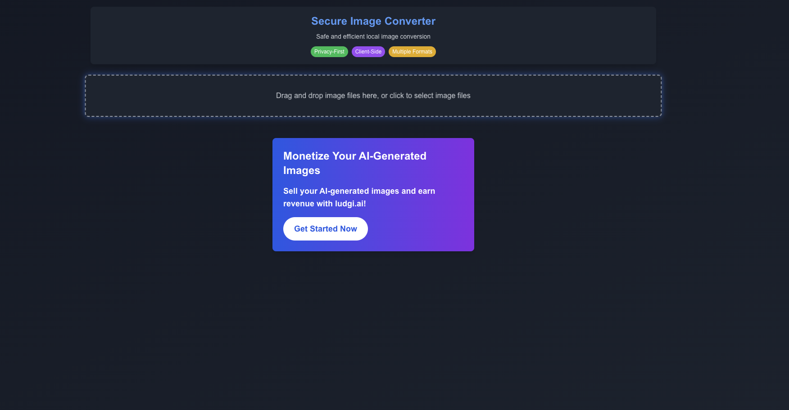

# safe_pic_convert

safe_pic_convert is a web application that allows users to securely convert images while protecting their privacy.




서비스 링크: https://imgconv.ludgi.ai/

- ludgi.ai 홍보용 평수 계산기 프로젝트

# sitemap 확인

https://imgconv.ludgi.ai/sitemap.xml
sitemap 파싱이 안되는 현상이 있음 원인 파악하기.

## Key Features

- Client-side image processing: Convert images directly in your browser, ensuring your personal data remains secure.
- Multiple image format support: Transform images between various formats effortlessly.
- User-friendly interface: Simple and intuitive design for easy use by anyone.

With this project, users can perform image conversions conveniently without worrying about privacy breaches or data leaks.

## Getting Started

```bash
npm run dev
```

Enjoy safe and efficient image conversion with safe_pic_convert!
